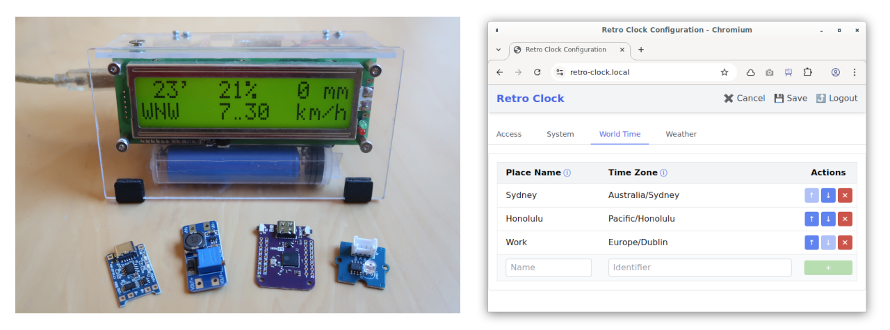
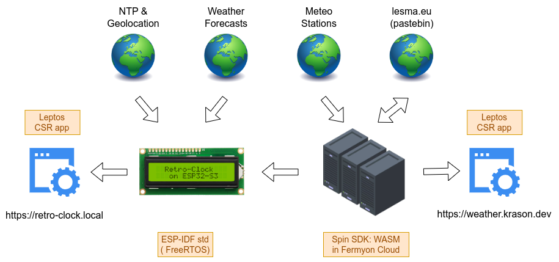

# Retro Clock

Prototype of a **clock** combined with **meteo station**.



## Features

<table>
<tr>
<td>

🕑 **Local Time**
- Auto-detect timezone
- Synchronize to NTP server

🌐 **Word Time**
- User-defined aliases for time zones
- Configurable through web UI

🌦 **Current Weather**
- Provide live data from dozens of Catalan meteo stations
- Configurable through web UI

🔭 **Weather Forecast**
- Auto-detect coordinates
- Forecast for current and the following day

💡 **Adaptive Illumination**
- Brightness automatically adjusted to the ambient
- Controls indicators and LCD background light

</td>
<td>

🛜︎ **Configuration Over WiFi**
- Self-hosted Web UI
- Domain in the local network provided by mDNS
- Access Point mode for initial configuration 

🕹 **Simple Controls**
- Busy & error indicators
- Device controlled by a single button
- Buzzer imitating clicking sound

🦺 **Failure Resistance**
- Restore WiFi connection after it's lost
- Switch to battery and energy-safe mode when power is gone

🔒 **Data Safety**
- Support HTTPS/TLS with safely distributed root CA certificate
- Password protected Web UI with JWT-based session

</td>
</tr>
</table>

## Implementation

Project consists of two parts:

<table>
<thead>
<tr>
<th>

**Embedded Application**

</th>
<th>

**Weather Web Service**

</th>
</tr>
</thead>
<tr>
<td>

Located in this repository
- Configuration UI, build in [Leptos](https://leptos.dev/)
- Firmware, build on top of [esp-idf](https://idf.espressif.com/)
- Runs on [Espressif ESP32-S3](https://www.espressif.com/en/products/socs/esp32-s3)

</td>
<td>

Located in: [weather-data-aggregator](https://github.com/gergelyk/weather-data-aggregator)
- Frontend, build in [Leptos](https://leptos.dev/)
- Backend, built on top of [Spin Framework](https://github.com/spinframework/spin)
- Deployed to the [Fermion Cloud](https://www.fermyon.com/)

</td>
</tr>
</table>

Everything built entirely in **Rust**! Including host-based simulator and development script `./dev.rs`.

Hardware built from [WEMOS S3 Mini](https://www.wemos.cc/en/latest/s3/s3_mini.html), popular HD44780 display and some other parts.

## System Overview



## Documentation

* [User Manual](docs/user-manual.md)
* [Hardware Guide](docs/hardware-guide.md)
* [Remaining docs](docs/)
* [Slides](https://filedn.com/ls8U70bX0lASS65WlPE8h3j/PERMALINKS/retro-clock-slides/index.html) <- contain many technical details
* [Video](https://www.youtube.com/watch?v=yR7irQRpGIg&t=46m0s) <- comments to the slides above

## Setup

- Install toolchains/targets as described in [retro-clock-esp](retro-clock-esp/README.md) and [retro-clock-webui](retro-clock-webui/README.md).

- Install the tools below. Some of them is used only be selected commands of `./dev.rs` and can be skiped if not needed:

    <table>
    <tr>
    <td>

    **General tools:**<br>
    *(possibly already in your system)*
    - [openssl](https://openssl-library.org/)
    - [mkcert](https://github.com/gergelyk/mkcert) (fork of [this](https://github.com/FiloSottile/mkcert))
    - [sd](https://github.com/chmln/sd)
    - [exa](https://github.com/ogham/exa)
    - [git](https://git-scm.com/)
    - [sed](https://www.gnu.org/software/sed/)
    - [rust-script](https://rust-script.org/)

    </td>
    <td>

    **For Web UI development:**
    - [zellij](https://zellij.dev/)
    - [trunk](https://trunkrs.dev/)
    - [leptosfmt](https://github.com/bram209/leptosfmt)
    - [brotli](https://github.com/google/brotli)

    ---

    **For intertacting with ESP32:**
    - [wesplot](https://github.com/cactusdynamics/wesplot)
    - [minicom](https://salsa.debian.org/minicom-team/minicom)
    - [bruno](https://www.usebruno.com/)

    </td>
    </tr>
    </table>

- Optionally install and start mDNS client, e.g. [avahi](https://avahi.org/). It is useful for resolving `retro-clock.local` domain. If you are under Ubuntu, it's probably done already.

- Setup environment (unless already done):
    ```sh
    # Certificate for TLS for HTTP server in `retro-clock-esp/certs`
    ../dev.rs new cert
    
    # Set env vars in `.env`, this includes secrets
    ./dev.rs new env
    ```

    `.env` file is automatically loaded by `./dev.rs` script whenever it is invoked. `.env` doesn't need to be sourced, unless you work in the individual sub-directories without `./dev.rs`.

## Building & Running

- Invoke one of the commands below:
    ```sh
    # Host-based simulation limited to core functionality with Web UI served locally
    ./dev.rs run sim
    
    # Application run in ESP32 target with Web UI served from the device
    ./dev.rs run esp
    
    # Application run in ESP32 target with Web UI served from the host
    ./dev.rs run mix
    ```

- Web browser will be opened at corresponding Web UI URL.
- For more details on ESP32 usage refer to [retro-clock-esp](retro-clock-esp/README.md).

## Development

After each change:

- Fix formating and linting issues:
    ```sh
    ./dev.rs fmt
    ./dev.rs cmd clippy
    ```

- Run the application and check heap usage while interacting with the app:
    ```sh
    ./dev.rs run esp -s
    ./dev.rs plot heap
    ```

- Use [Bruno](https://www.usebruno.com/) as an alternative to the Web UI for interacting with the device or simulator. For more details see [Bruno Usage](docs/bruno-usage.md).

## Releasing & Deploying

- Make sure that `.env` doesn't contain any temporary data. It's best to generate a new one: `./dev.rs new env`
- Build the application in release mode and upload to ESP32 target:
  ```sh
  ./dev.rs run esp --release
  ```
- For more details on ESP32 usage refer to [retro-clock-esp](retro-clock-esp/README.md).

